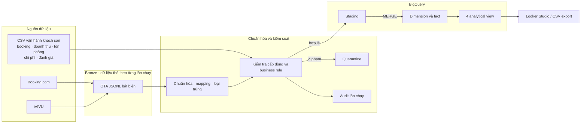
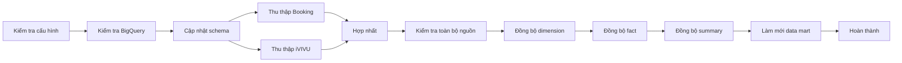

# 🏨 Hotel Market Intelligence & Automated Data Warehouse for HAIAN Beach Hotel & Spa


## Tổng quan dự án

Đây là dự án Data Analytics kết hợp Data Engineering end-to-end dành cho bài toán quản trị doanh thu tại **HAIAN Beach Hotel & Spa**. Dự án tích hợp dữ liệu vận hành nội bộ—bao gồm booking, doanh thu, tồn phòng, chi phí và đánh giá khách hàng—với dữ liệu giá phòng đối thủ được thu thập từ Booking.com và iVIVU.

Ở góc độ **Data Analyst**, dự án tập trung xây dựng hệ thống KPI, phân tích các yếu tố ảnh hưởng đến lợi nhuận và thiết kế dashboard hỗ trợ Revenue Manager ra quyết định. Ở góc độ **Data Engineering**, toàn bộ dữ liệu được thu thập, kiểm tra chất lượng, mô hình hóa, nạp vào BigQuery và tự động hóa bằng Apache Airflow.

## Vấn đề doanh nghiệp

Từ tháng 6 đến tháng 8 năm 2025, chỉ số **ProfitPAR của HAIAN Beach Hotel & Spa chỉ đạt 550.000 VNĐ/phòng, thấp hơn mục tiêu 750.000 VNĐ/phòng**, cho thấy hiệu quả khai thác phòng và khả năng tối ưu lợi nhuận chưa đạt kỳ vọng.

Mặc dù khách sạn có thể duy trì công suất và doanh thu ở mức cao, lợi nhuận thực tế vẫn chịu ảnh hưởng bởi nhiều yếu tố như giá bán phòng, cơ cấu loại phòng, chi phí vận hành, hoa hồng OTA, chương trình khuyến mãi và cơ cấu kênh phân phối. Nếu chỉ theo dõi doanh thu hoặc Occupancy, nhà quản lý khó xác định nguyên nhân thực sự làm ProfitPAR chưa đạt mục tiêu.

Dự án vì vậy hướng tới xây dựng một nguồn dữ liệu tập trung và hệ thống phân tích có khả năng phân rã khoảng cách lợi nhuận, xác định các yếu tố tác động và hỗ trợ lựa chọn hành động phù hợp.

## Câu hỏi phân tích

1. ProfitPAR, Net Profit, RevPAR, ADR và Occupancy biến động như thế nào trong giai đoạn tháng 6–8/2025?
2. Khoảng cách giữa ProfitPAR thực tế và mục tiêu 750.000 VNĐ/phòng đến từ giá bán, công suất, cơ cấu phòng, cơ cấu kênh hay chi phí?
3. Những ngày trong tuần, loại phòng, phân khúc khách hàng và kênh bán nào tạo ra doanh thu và lợi nhuận tốt nhất?
4. Chi phí hoa hồng và phân phối qua OTA ảnh hưởng như thế nào đến Net ADR và lợi nhuận theo kênh?
5. Lead time, tỷ lệ hủy phòng và thời gian lưu trú tác động như thế nào đến hiệu quả khai thác phòng?
6. Giá phòng của HAIAN đang ở vị trí nào so với nhóm khách sạn cạnh tranh trong cùng ngày lưu trú và điều kiện giá?
7. Những vấn đề nào trong trải nghiệm khách hàng có thể ảnh hưởng đến khả năng duy trì giá bán và lợi nhuận?

| Hạng mục | Kết quả thực hiện |
|---|---|
| Phân tích nghiệp vụ | Xác định câu hỏi quản trị doanh thu, KPI, hướng phân tích và đề xuất hành động |
| Phân tích dữ liệu | ProfitPAR, ADR, RevPAR, công suất phòng, chi phí kênh, hủy phòng, lead time, đánh giá khách và giá đối thủ |
| Mô hình dữ liệu | Mô hình chiều trên BigQuery gồm 7 dimension, 7 fact, 1 bảng KPI tổng hợp và 4 analytical view |
| Data pipeline | Thu thập và kiểm tra bằng Python, điều phối Airflow, incremental load vào BigQuery, quarantine và audit |
| Bàn giao | Dữ liệu cho Looker Studio, Docker, automated test, CI, tài liệu kỹ thuật, báo cáo và slide thuyết trình |

## Kết quả phân tích nổi bật

Dữ liệu vận hành lịch sử được phân tích trong giai đoạn **tháng 6–8/2025**. Các KPI dạng tỷ lệ được tính theo tỷ lệ của tổng thay vì lấy trung bình cộng các tỷ lệ theo ngày.

| Phát hiện | Bằng chứng | Hàm ý hành động |
|---|---:|---|
| Lợi nhuận chưa đạt mục tiêu | ProfitPAR trung bình khoảng **550 nghìn VND**, thấp hơn mục tiêu **750 nghìn VND** | Tối ưu lợi nhuận trên mỗi phòng khả dụng thay vì chỉ theo doanh thu hoặc công suất |
| Tháng 7 có hiệu quả tốt nhất | Occupancy **91,7%**, ADR **2,54 triệu VND**, ProfitPAR **758 nghìn VND** | Xác định và tái áp dụng điều kiện giá và cơ cấu bán của tháng 7 khi nhu cầu cho phép |
| Cuối tuần tạo ra nhiều giá trị hơn | ProfitPAR thứ Bảy/Chủ nhật khoảng **885/862 nghìn VND**, trong khi thứ Hai khoảng **493 nghìn VND** | Áp dụng chính sách giá và kiểm soát tồn phòng theo ngày trong tuần |
| Kênh trực tiếp có lợi thế về chi phí phân phối | Website có ADR khoảng **2,28 triệu VND** và distribution rate **4,7%**; Booking.com khoảng **25,1%** | Theo dõi Net ADR và contribution sau chi phí kênh; tăng tỷ trọng đặt phòng trực tiếp |
| Hành vi đặt phòng cung cấp tín hiệu dự báo | Tỷ lệ hủy **9,49%**, lead time trung vị **36 ngày**, thời gian lưu trú trung bình **2,32 đêm** | Đưa booking window, hủy phòng và length of stay vào quyết định doanh thu |
| Trải nghiệm khách có thể giới hạn khả năng tăng giá | Điểm đánh giá trung bình **4,45/5**; vấn đề thường gặp gồm chờ thang máy, kỳ vọng về view phòng và xếp hàng ăn sáng | Kết nối vấn đề dịch vụ với loại phòng, kênh bán, hủy phòng và chính sách giá |

Các kết quả trên mô tả giai đoạn lịch sử đã phân tích, không phải kết luận quan hệ nhân quả hoặc kết quả của một thử nghiệm giá có đối chứng.

## Luồng ra quyết định của dashboard

Lớp BI được thiết kế như một Revenue Command Center thay vì tập hợp các biểu đồ rời rạc:

- **Hiệu quả điều hành:** Net Revenue, Net Profit, ProfitPAR, Occupancy, ADR, Net RevPAR, chênh lệch mục tiêu và xu hướng.
- **Chẩn đoán doanh thu:** heatmap theo ngày trong tuần, ma trận giá–công suất theo loại phòng, lợi nhuận theo kênh, booking window, tỷ lệ hủy và length of stay.
- **Phân tích thị trường:** giá khách sạn cạnh tranh, tình trạng còn phòng, trung vị/khoảng giá và vị thế giá—chỉ hiển thị khi HAIAN và đối thủ có cùng ngày lưu trú và điều kiện giá có thể so sánh.
- **Chi phí và lợi nhuận:** Contribution Profit, Net Profit, CostPAR, biến động chi phí và profit bridge.
- **Trải nghiệm khách và độ tin cậy dữ liệu:** rating, nhóm phàn nàn, độ mới dữ liệu, dòng bị loại, dữ liệu trùng và độ bao phủ.

Định nghĩa KPI và hướng dẫn dựng dashboard nằm trong [docs/LOOKER_STUDIO_DASHBOARD.vi.md](docs/LOOKER_STUDIO_DASHBOARD.vi.md). Tư duy phân tích và thiết kế lại dashboard nằm trong [docs/DASHBOARD_REDESIGN_V2.vi.md](docs/DASHBOARD_REDESIGN_V2.vi.md).

## Định nghĩa KPI

Các KPI khách sạn được tính có trọng số tại cấp độ báo cáo được chọn:

```text
Occupancy  = SUM(Rooms Sold) / SUM(Available Rooms)
ADR        = SUM(Net Room Revenue) / SUM(Rooms Sold)
Net RevPAR = SUM(Net Room Revenue) / SUM(Available Rooms)
Net Profit = SUM(Net Room Revenue) - SUM(Operating Cost)
ProfitPAR  = Net Profit / SUM(Available Rooms)
```

Cách tính này tránh hai lỗi BI phổ biến: lấy trung bình các tỷ lệ đã tính sẵn theo ngày và cộng ProfitPAR của nhiều ngày với nhau.

## Kiến trúc end-to-end



Luồng production hoạt động theo quy trình deterministic và không phụ thuộc vào LLM. AI Agent là lớp hỗ trợ vận hành tùy chọn, không thay thế scheduler hoặc nguồn sự thật kỹ thuật.

## Mô hình dữ liệu

Data Warehouse sử dụng dimensional modeling với grain, primary key, foreign-key validation và trường partition theo ngày được định nghĩa rõ ràng.

- **Dimension:** ngày, khách sạn, loại phòng, kênh bán, phân khúc khách, nhóm chi phí và chương trình khuyến mãi.
- **Fact:** booking, tồn phòng, chi phí phòng, doanh thu phòng, chi phí phân phối, đánh giá khách và giá phòng đối thủ.
- **Gold view:** phân tích chi phí ngày, ProfitPAR ngày, tổng hợp giá đối thủ và so sánh giá HAIAN với thị trường.


ERD, grain, khóa và data dictionary đầy đủ nằm trong [docs/data-model.vi.md](docs/data-model.vi.md). Schema thực thi nằm trong [agents/bq_schemas.py](agents/bq_schemas.py).

## Pipeline tự động

Airflow DAG chạy hằng ngày lúc **02:00 theo múi giờ Asia/Ho_Chi_Minh**. Hai tác vụ thu thập Booking.com và iVIVU chạy song song trước khi hợp nhất thành một bộ dữ liệu canonical.



Các cơ chế kỹ thuật chính:

- schema BigQuery tường minh thay vì suy luận kiểu dữ liệu;
- staging kết hợp `MERGE` để incremental load có tính idempotent;
- chế độ full snapshot `WRITE_TRUNCATE` dành cho BigQuery Sandbox;
- kiểm tra cấp dòng, business rule, foreign key và overbooking;
- lưu dòng vi phạm vào quarantine thay vì tự động sửa âm thầm;
- audit theo từng lần chạy, bao gồm trạng thái stage và số dòng;
- Airflow LocalExecutor và PostgreSQL chạy bằng Docker, có healthcheck và init service;
- GitHub Actions kiểm tra compile, Ruff, pytest/coverage, Docker Compose và image build.

## Ví dụ kiểm tra chất lượng dữ liệu

Kết quả QA đi kèm dự án cho thấy:

- 8.248 booking có khóa duy nhất;
- không có overbooking theo loại phòng và ngày lưu trú;
- ngày check-out của booking đã xác nhận luôn sau ngày check-in;
- không có gross booking revenue âm;
- toàn bộ room-night nội bộ thuộc giai đoạn phân tích tháng 6–8/2025.

Logic kiểm tra nằm trong [agents/data_quality.py](agents/data_quality.py). Kết quả từng lần chạy được ghi vào `Data/Quarantine/<run_id>/` và `Data/Audit/<run_id>/`.

## Cấu trúc repository

```text
.
├── agents/                  # Schema BigQuery, ETL, DQ, data mart và pipeline CLI
├── dags/                    # Airflow DAG gồm 12 task
├── scrapers/                # Bộ thu thập Booking và iVIVU bằng Playwright
├── Data/
│   ├── Raw/                 # Dữ liệu nguồn và canonical CSV
│   ├── Bronze/              # Dữ liệu OTA bất biến theo từng lần chạy
│   ├── Quarantine/          # Dòng bị loại và mã lỗi
│   ├── Audit/               # Kết quả audit pipeline và DQ
│   └── Presentation/        # Dữ liệu xuất cho Looker Studio
├── docs/                    # Mô hình dữ liệu, dashboard và tài liệu vận hành
├── tests/                   # Unit test và contract test
├── tools/                   # Tạo lịch, export, migration và local status UI
├── .github/workflows/       # Continuous Integration
├── docker-compose.yml
└── HUONG_DAN_CHAY_PROJECT.md
```

## Hướng dẫn chạy dự án

### Yêu cầu

- Docker Desktop hoặc Docker Engine có Docker Compose
- Google Cloud project đã bật BigQuery
- BigQuery dataset, mặc định là `haian_dwh` tại `asia-southeast1`
- service account có quyền chạy job và đọc/ghi dataset

### Khởi động hệ thống

```powershell
Copy-Item .env.example .env
Copy-Item C:\duong-dan\service-account.json secrets\gcp-service-account.json
docker compose config --quiet
docker compose up -d --build
```

Mở `http://localhost:8080`, đăng nhập bằng tài khoản đã cấu hình trong `.env`, bật DAG và trigger `haian_competitor_price_pipeline`.

Không commit `.env` hoặc service-account key. Hướng dẫn đầy đủ, lệnh chạy từng stage và cách xử lý lỗi nằm trong [HUONG_DAN_CHAY_PROJECT.md](HUONG_DAN_CHAY_PROJECT.md).

### Chạy kiểm tra

```powershell
py -3.10 -m venv .venv
.\.venv\Scripts\Activate.ps1
python -m pip install -r requirements-dev.txt
python -m playwright install chromium

python -m compileall -q agents dags scrapers tools tests
ruff check agents dags scrapers tools tests
pytest --cov --cov-report=term-missing
```

## Phạm vi và giới hạn dữ liệu

Repository thể hiện một quy trình phân tích và dữ liệu end-to-end, không phải hệ thống production đang vận hành trực tiếp tại HAIAN.

- Dữ liệu vận hành lịch sử bao phủ giai đoạn tháng 6–8/2025, trong khi dữ liệu OTA hiện tại chứa ngày lưu trú tương lai trong năm 2026.
- Không được ghép ADR lịch sử của HAIAN với giá đối thủ tương lai như dữ liệu cùng kỳ. Price Index chỉ được tính khi có giá công khai của HAIAN và đối thủ cho cùng ngày lưu trú, loại phòng và điều kiện giá có thể so sánh.
- Việc thu thập OTA phụ thuộc vào cấu trúc trang, điều kiện truy cập và điều khoản của nền tảng; selector cần được giám sát khi vận hành.
- Test cục bộ, cấu trúc DAG và cấu hình container có thể được kiểm tra không cần cloud credential. Thu thập website và ghi BigQuery thực tế cần kết nối mạng cùng tài khoản GCP do người vận hành cung cấp.
- Các đề xuất là giả thuyết phân tích. Tác động thương mại cần được xác nhận bằng thử nghiệm giá hoặc kênh bán có kiểm soát.

## Kỹ năng thể hiện qua dự án

**Data Analytics:** xác định bài toán kinh doanh, quản trị KPI, SQL/BigQuery, phân tích dữ liệu, dimensional modeling, thiết kế dashboard, đánh giá chất lượng dữ liệu, truyền đạt insight và xây dựng đề xuất có thể hành động.

**Data Engineering:** Python ETL, thu thập dữ liệu bằng Playwright, điều phối Airflow, incremental load vào BigQuery, quarantine và audit, Docker, automated testing và CI.
---

## 📊 8. Hệ thống Dashboard Phân tích (Looker Studio)

Để chuyển đổi dữ liệu thô thành những thông tin chi tiết có giá trị hành động, tôi đã thiết kế 3 Dashboard Quản trị kết nối trực tiếp với các Data Marts trên BigQuery.

### 💰 8.1. Dashboard Quản trị Doanh thu (Revenue Management)
<!-- 📸 THÊM ẢNH REVENUE DASHBOARD VÀO DÒNG BÊN DƯỚI -->


**Phân tích & Insight:** Phân rã doanh thu theo Kênh (Channel) và Phân khúc Khách hàng (Customer Segment). Giúp phát hiện nhanh tình trạng nếu Công suất phòng (Occupancy) rất cao nhưng RevPAR lại thấp, báo hiệu rằng khách sạn đang bán phòng với giá quá rẻ.

### 📈 8.2. Dashboard Phân tích Lợi nhuận (Profitability Management)
<!-- 📸 THÊM ẢNH PROFITABILITY DASHBOARD VÀO DÒNG BÊN DƯỚI -->


**Phân tích & Insight:** Trực quan hóa dòng chảy (Waterfall) từ Doanh thu gộp đến Lợi nhuận ròng. Trả lời câu hỏi sống còn: *"Liệu các chương trình voucher và tiền hoa hồng OTA có đang "ăn" hết lợi nhuận của chúng ta không?"* Dashboard giúp xác định chính xác ProfitPAR thực tế mang lại từ từng nguồn đặt phòng.

### 🕵️ 8.3. Dashboard Tình báo Thị trường (Market Intelligence)
<!-- 📸 THÊM ẢNH MARKET INTELLIGENCE DASHBOARD VÀO DÒNG BÊN DƯỚI -->


**Phân tích & Insight:** So sánh ADR (Giá bán bình quân) của HAIAN với giá trung bình của thị trường xung quanh. Hệ thống trực quan hóa cảnh báo ngay lập tức khi đối thủ giảm giá mạnh hoặc hết phòng (Sold-out). Từ đó, khách sạn có thể áp dụng chiến lược **Định giá Động (Dynamic Pricing)** một cách linh hoạt.

---

## 🎯 9. Đề xuất Kinh doanh (Actionable Insights)
Dựa trên dữ liệu được thu thập và phân tích từ hệ thống Dashboard, dưới đây là các đề xuất chiến lược dựa trên dữ liệu (Data-driven) nhằm khôi phục ProfitPAR về mức mục tiêu 850.000 VNĐ:

1. **Áp dụng Định giá Động (Dynamic Pricing) theo Chỉ số Cạnh tranh:** Dữ liệu cho thấy khi các đối thủ cùng phân khúc đạt tỷ lệ lấp đầy (Sold-out rate) **> 85%** trên Booking.com, hệ thống của HAIAN vẫn đang giữ nguyên mức giá cố định. Khuyến nghị: Thiết lập quy tắc tự động tăng ADR lên **5% - 10%** ngay khi nguồn cung thị trường xung quanh khan hiếm. Thao tác này ước tính có thể cải thiện RevPAR thêm **8%** trong các dịp lễ.
2. **Tối ưu hóa Kênh Phân phối để Giảm chi phí OTA:** Dashboard Lợi nhuận chỉ ra rằng dù OTA chiếm **65% tổng doanh thu**, nhưng chi phí hoa hồng (15-20%) đã bào mòn đáng kể lợi nhuận ròng. Ngược lại, kênh Direct Booking (đặt trực tiếp) có biên lợi nhuận cao hơn **18%**. Khuyến nghị: Dịch chuyển 15% ngân sách từ các chiến dịch giảm giá trên OTA sang các chiến dịch Marketing nội bộ để thúc đẩy Direct Booking đối với nhóm khách hàng FIT (Khách lẻ).
3. **Đánh giá lại Chiến lược Phát hành Voucher:** Việc giảm giá ồ ạt qua Voucher trong tháng 7 khiến ADR giảm sâu nhưng Occupancy (Công suất phòng) chỉ tăng nhẹ **2.5%**, dẫn đến ProfitPAR sụt giảm nghiêm trọng. Khuyến nghị: Dừng việc phát hành voucher giảm giá đại trà. Chuyển sang chiến lược Upselling (nâng hạng phòng) hoặc áp dụng điều kiện "Lưu trú tối thiểu 3 đêm" để tối đa hóa lợi nhuận trên mỗi khách hàng.

---

## 🎓 10. Mình đã học được gì qua dự án ? 
Thông qua việc tự tay xây dựng dự án Data Warehouse toàn diện này, tôi đã đúc kết được những kinh nghiệm vô giá không chỉ về mặt công cụ mà còn về tư duy giải quyết vấn đề:

* **Quản trị Pipeline với Apache Airflow:** Hiểu sâu về cách điều phối (Orchestration), lên lịch trình (DAGs) và giám sát trạng thái của các luồng dữ liệu (ETL pipeline). Điều này giúp tôi nhận ra tầm quan trọng của việc tự động hóa và khả năng theo dõi luồng dữ liệu một cách trực quan thay vì chạy script thủ công.
* **Tích hợp AI Agent vào Data Engineering:** Tiên phong trong việc sử dụng Google ADK (Gemini LLM) làm "trái tim" điều phối hệ thống. Tôi học được cách biến AI từ một công cụ chat trở thành một Agent có khả năng tự động phân tích tình huống và ra quyết định trình tự chạy các tác vụ cào dữ liệu một cách linh hoạt.
* **Tư duy Phân tích Hệ thống & Mô hình hóa (Data Modeling):** Học được cách bóc tách một bài toán kinh doanh "mù mờ" (Làm sao để tăng lợi nhuận khách sạn?) thành các thực thể dữ liệu rõ ràng. Từ đó, tôi biết cách thiết kế mô hình **ERD (Fact & Dimension)** chuẩn mực sao cho đáp ứng được mọi góc độ phân tích và vẽ Dashboard một cách mượt mà nhất.

---

Cảm ơn bạn đã quan tâm đến dự án của tôi! Nếu có cơ hội trao đổi hoặc hợp tác, vui lòng liên hệ với tôi qua Email: hoquocuong2005@gmail.com 

